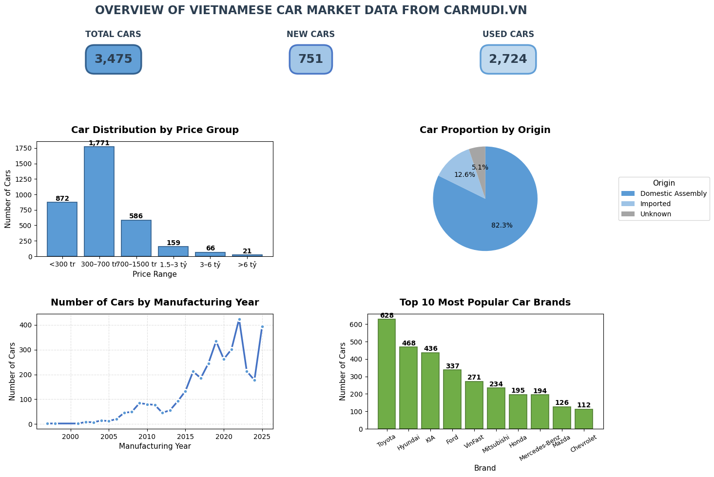

# Carmudi.vn Car Data Scraping and Analysis

This project scrapes car listing data from Carmudi.vn, performs data cleaning and transformation, and visualizes key insights using Python libraries like Selenium, BeautifulSoup, Pandas, and Matplotlib.

## Technologies Used

* Python 3.11
* Jupyter Notebook
* Selenium (for initial link scraping)
* Requests & BeautifulSoup (for detail scraping)
* Pandas (for data manipulation and cleaning)
* NumPy (for numerical operations)
* Matplotlib (for data visualization)
* re (Regular Expressions for data extraction/cleaning)

## Project Workflow

1.  **Extract:**
    * Uses Selenium to navigate through Carmudi's car listing pages and collect individual car detail page URLs. Saves links to `link_cars_detail.csv` (Note: This file isn't included in the repo, the notebook generates it).
    * Uses Requests and BeautifulSoup to scrape detailed information (price, manufacturer, year, mileage, specs, etc.) from each car URL. Saves raw data to `crawl_cars_1.csv` (Note: This file isn't included in the repo).
2.  **Transform:**
    * Reads the raw scraped data using Pandas.
    * Cleans and standardizes various columns:
        * `price`: Converts text representations (e.g., "1 tỷ 200 triệu", "450 triệu") into numerical values (millions VND).
        * `created`: Parses the listing date into datetime format.
        * `manufacture_year`: Converts to integer.
        * `city`: Extracts standardized province names.
        * `mileage`: Converts text (e.g., "50,000 km", "Xe mới") into numerical kilometers (0 for new cars).
        * `condition`: Derives "Xe mới" or "Đã qua sử dụng" based on cleaned mileage.
        * `origin`: Infers origin ("Lắp ráp trong nước", "Nhập khẩu") based on the car brand using a predefined mapping.
    * Handles missing values (e.g., fills missing `city` with "Không xác định").
    * Applies data scaling techniques (Min-Max Scaling, Z-score Standardization, Log Transform) to `price` and `mileage` columns for analytical purposes (results saved in `crawl_cars_1_cleaned_zscore.csv`).
    * Saves the primary cleaned dataset to `crawl_cars_1_cleaned_zscore.csv` (included in this repo).
3.  **Visualize:**
    * Uses Matplotlib to create a dashboard overview summarizing the dataset, including:
        * Distribution of cars by price range.
        * Proportion of cars by origin (domestic assembly vs. import).
        * Trend of car listings by manufacturing year.
        * Top 10 most popular car brands.
        * Key summary statistics (Total cars, New cars, Used cars).

## Setup and Installation

1.  **Clone the repository:**
    ```bash
    git clone https://github.com/cxashs/btl_datascience_carmudi.git
    cd Car-Data-Scraping-Analysis
    ```

2.  **Create a virtual environment (recommended):**
    ```bash
    python -m venv .venv
    # On Windows
    .\.venv\Scripts\activate
    # On macOS/Linux
    source .venv/bin/activate
    ```

3.  **Install required libraries:**
    ```bash
    pip install -r requirements.txt
    ```

4.  **Download ChromeDriver:**
    * This project uses Selenium with Chrome. You need to download the `chromedriver` executable that matches **your version of Google Chrome** and **your operating system**.
    * Find your Chrome version (Help -> About Google Chrome).
    * Download the corresponding `chromedriver` from the official site: [https://chromedriver.chromium.org/downloads](https://chromedriver.chromium.org/downloads) (or check the newer dashboard: [https://googlechromelabs.github.io/chrome-for-testing/](https://googlechromelabs.github.io/chrome-for-testing/)).
    * **Place the downloaded `chromedriver.exe` (or `chromedriver` on macOS/Linux) file in the SAME directory as the `carmudi_scraper_analyzer.ipynb` notebook.** The code currently expects it to be there. Alternatively, ensure its location is in your system's PATH.

## Usage

1.  Ensure you have completed the Setup steps (installed libraries, placed `chromedriver`).
2.  Open the `carmudi_scraper_analyzer.ipynb` file using Jupyter Notebook, Jupyter Lab, or VS Code with the Python extension.
3.  Run the cells sequentially.
    * The "Extract" section will scrape data (this might take some time).
    * The "Transform" section will clean the data and save `crawl_cars_1_cleaned_zscore.csv`.
    * The "Visualization" section will generate the dashboard plots using the cleaned data.

## Results Overview

The analysis provides insights into the Vietnamese car market as listed on Carmudi.vn.

